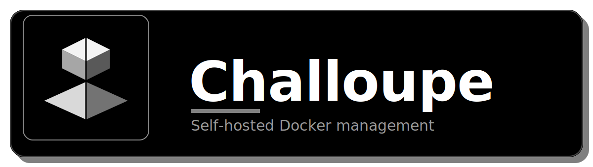

<p align="center">
  
</p>

A self-hosted Docker manager: containers, images, volumes, networks, compose stacks, and user management — across the local host and any number of remote Docker hosts over SSH.

## Architecture

| Directory | Role | Technologies |
|---|---|---|
| `apps/server` | REST + WebSocket API, serves the built frontend | Express 5, ws, dockerode, ssh2, better-sqlite3, express-session, bcryptjs, zod |
| `apps/web` | Web interface (SPA) | React 18, Ant Design 5, TanStack Query, CodeMirror, xterm.js, Vite |

- **Docker**: the server talks to `/var/run/docker.sock` via dockerode for the local host.

- **Multi-host management**: add remote Docker hosts reachable over SSH. SSH private keys/passphrases are encrypted at rest and never returned by the API.

- **Stacks**: each stack is a `docker-compose.yml` under `data/stacks/<name>/`, deployed with the real `docker compose -p <name> up -d`.

- **Deploy webhooks**: each stack can generate a one-time deploy token (a stack's page, "Deploy webhook") that lets a CI pipeline trigger `docker compose pull && up -d` with a plain unauthenticated `POST` request.

- **Users**: SQLite (`data/challoupe.db`), bcrypt password hashes, httpOnly cookie sessions. Two roles: `admin` (manages users and settings, has every permission) and `user`. First run prompts you to create the admin account.

- **Two-factor authentication**: any local account can enable TOTP (Google Authenticator, Authy, etc.) from the user menu: QR code, confirmation code, then single-use backup codes shown once. Not available for SSO accounts. Admins can reset a user's 2FA from the Users page.

- **Permissions**: each `user` account can be granted any of eight capabilities from the Users page: manage containers, images, volumes, networks, or stacks (create/delete only, listing and start/stop/restart stay open to everyone), open a container terminal, use the AI assistant, use the vulnerability scanner. All off by default except the AI assistant and vulnerability scanner. Enforced on both the API and the UI.

- **Container creation**: beyond image/ports/env/volumes/restart policy, "Advanced settings" adds network selection, command override, working directory, user, labels, privileged mode, auto-remove, and memory/CPU limits.

- **Stack drift detection**: the Stacks list and each stack's page flag drift: a service stopped or removed outside Challoupe, an orphaned container Compose no longer knows about, or a running image that no longer matches the compose file.

- **AI Assistant (local Ollama)**: point Settings at a local or LAN [Ollama](https://ollama.com) server, nothing leaves that instance:
  - **Log diagnosis**: a "Diagnose with AI" button on a container's Logs tab explains what's happening and suggests a fix.
  - **Stack generation**: "Generate with AI" in the stack editor turns a description into a draft docker-compose.yml.
  - **Chat assistant**: a floating button opens a chat panel aware of your current containers.

- **Vulnerability scanning (local Trivy)**: a "Scan" action on the Images page runs [Trivy](https://trivy.dev) as a one-off container (Docker socket mounted in, no persistent service). Vulnerability database cached under `data/trivy-cache/`. Returns a severity-sorted CVE list.

- **Resource alerts**: periodically checks CPU, memory, and disk usage against configurable thresholds and notifies over the channels below when one is crossed.

- **Notifications**: an optional webhook (Discord, Slack, or generic JSON) and/or [ntfy](https://ntfy.sh) push notifications post on container crashes, scheduled image updates, resource alerts, and scheduled backup failures. Configured from Settings, off by default.

- **Audit log**: an admin-only page (`audit_log` table) records who did what: resource mutations, user management, settings changes, scans, sign-ins, password changes, and denied permission checks. Toggled from the page itself, on by default; turning it off stops new entries without erasing history.

- **Backup/restore**: exports every user, all settings, and every stack's compose file as one JSON file. Restoring replaces everything and signs everyone out. An optional scheduler writes the same export to `data/backups/` on a timer, pruning to a configured number of files.

## Getting started

```bash
npm install

# Development (API on :3001, Vite on :5173 with an /api proxy)
npm run dev

# Production
npm run build
npm start          # serves the full app on http://localhost:3001
```

## Running in Docker

```bash
docker compose up -d --build
```

Builds the image from the included multi-stage `Dockerfile` (compiles both workspaces, then a slim runtime with the Docker CLI + Compose plugin, needed since stacks shell out to `docker compose`), mounts `/var/run/docker.sock` to manage the host's Docker daemon, and persists `data/` in a named volume. Runs as root since the host socket's group ownership isn't predictable at build time.

To serve HTTPS directly, set `TLS_CERT_FILE`/`TLS_KEY_FILE` (see below) to a cert/key pair mounted into the container; `docker-compose.yml` has a commented-out example. Otherwise put a reverse proxy (Traefik, Caddy, nginx) in front.

The Storage stat needs the host's Docker root directory mounted (read-only) at the same path to read real disk usage; `docker-compose.yml` has a commented-out example. Find the path with `docker info --format '{{.DockerRootDir}}'` (usually `/var/lib/docker`).

## Testing

```bash
npm test            # runs both apps' test suites
npm run test -w apps/server   # backend only (vitest + supertest, mocked Docker client)
npm run test -w apps/web      # frontend only (vitest + Testing Library)
```

Tests run against an in-memory database and an isolated temp directory (`NODE_ENV=test`), never touching your real `data/` directory. Container/image route tests mock the `dockerode` client instead of hitting a real daemon.

## Configuration (environment variables)

| Variable | Default | Description |
|---|---|---|
| `PORT` | `3001` | Server listen port |
| `HOST` | `0.0.0.0` | Listen interface |
| `DATA_DIR` | `./data` | SQLite database, session secret, host SSH encryption key, and stacks |
| `DOCKER_SOCK` | `/var/run/docker.sock` | Docker socket |
| `SESSION_SECRET` | generated and persisted under `data/` | Session signing secret |
| `TLS_CERT_FILE` | unset | Path to a PEM certificate (set together with `TLS_KEY_FILE` to serve HTTPS directly) |
| `TLS_KEY_FILE` | unset | Path to the matching PEM private key |
| `TRUST_PROXY` | `false` | Set to `true` only behind a trusted reverse proxy forwarding `X-Forwarded-*`; fixes the session cookie's `Secure` flag and audit-log IP |
| `PUBLIC_URL` | reflects the incoming request | Externally-reachable base URL (e.g. `https://challoupe.example.com`), needed if a proxy hides the original host/proto. Used for the OIDC callback URL |
